# 常见的跨端方案

[demo 地址](https://github.com/wayshon/jsbridge-demo)

## hybrid - webview 时代

#### URL 拦截
webview 能够执行js，监听url的跳转，加载，失败/成功，返回等 delegate。

通过约束 url，比如 schema，js 需要唤起OC的时候跳转指定的约束的 url，OC 拦截 url 判断是允许跳转还是自定义操作

```javascript
location.href = 'alert://哈哈哈哈'
```

```objective-c
- (void)webView:(WKWebView *)webView decidePolicyForNavigationAction:(WKNavigationAction *)navigationAction decisionHandler:(void (^)(WKNavigationActionPolicy))decisionHandler {
    NSString * urlStr = navigationAction.request.URL.absoluteString;
    NSLog(@"发送跳转请求：%@",urlStr);
    //自己定义的协议头
    NSString *htmlHeadString = @"alert://";
    NSString *decodedString=(__bridge_transfer NSString *)CFURLCreateStringByReplacingPercentEscapesUsingEncoding(NULL, (__bridge CFStringRef)[urlStr substringFromIndex: 8], CFSTR(""), CFStringConvertNSStringEncodingToEncoding(NSUTF8StringEncoding));
    if([urlStr hasPrefix:htmlHeadString]){
        UIAlertController *alertController = [UIAlertController alertControllerWithTitle:@"通过截取URL调用OC" message:decodedString preferredStyle:UIAlertControllerStyleAlert];
        [alertController addAction:([UIAlertAction actionWithTitle:@"哦哦" style:UIAlertActionStyleCancel handler:^(UIAlertAction * _Nonnull action) {}])];
        [self presentViewController:alertController animated:YES completion:nil];
        decisionHandler(WKNavigationActionPolicyCancel);
    }else{
        decisionHandler(WKNavigationActionPolicyAllow);
    }
}
```

### JavaScriptCore
JSContext 可以创建js的执行上下文或者通过 KVC 的方式取到`UIWebview`的js上下文(注意WKWebview不能取到)

获取到上下文对象 JSContext 后，可以把 OC 的对象注入到 js，js 在上下文中可以取到这个注入的对象

```objective-c
//创建context
    self.context = [_webView valueForKeyPath:@"documentView.webView.mainFrame.javaScriptContext"]; // wkwebview 里没有这玩意
    //设置异常处理
    self.context.exceptionHandler = ^(JSContext *context, JSValue *exception) {
        [JSContext currentContext].exception = exception;
        NSLog(@"exception:%@",exception);
    };
    //将obj添加到context中
    self.context[@"OCObj"] = self;
```

被注入的OC对象需要定义 JSExport 协议，并实现，js 能够调用OC对象的定义在 JSExport 里的方法，注意OC的消息与js的方法结构不一样，需要用 JSExportAs 转换

```objective-c
//定义一个JSExport protocol
@protocol JSExportProtocol <JSExport>

//用宏转换下，将JS函数名字指定为add；
JSExportAs(add, - (NSInteger)add:(NSInteger)n1 with:(NSInteger)n2);
JSExportAs(addByCallback, - (void)add:(NSInteger)n1 with:(NSInteger)n2 callback:(JSValue *)cb);
JSExportAs(openWKWebView, - (void)openWKWebView:(id)param);
JSExportAs(callThread, - (void)callThread:(id)param);
JSExportAs(showHtml, - (void)showHtml:(NSString *)str);

@end
```

```javascript
	  function callOCGetReturn() {
            // 调用 OC 方法，OCObj 是注入的全局变量
            const sum = OCObj.add(Math.random() * 10, 6);
            const el = document.createElement('h1');
            el.innerText = `同步的结果: ${sum}`;
            document.body.appendChild(el);
        }

        function callOCWithBlock() {
            OCObj.addByCallback(Math.random() * 10, 6, function (sum) {
                const el = document.createElement('h1');
                el.innerText = `回调的结果: ${sum}`;
                document.body.appendChild(el);
            });
        }
```

JSContext 可以执行一段js，可以带上参数和获取返回值，并且参数可以传 block，这就可以使 js 里异步执行传递的 block

```objective-c
	//  调用js的时候传参为一个数组，相当于 fn.apply(null, [xx])
    [_context[@"changeColor"] callWithArguments:@[@"green", @"yellow", ^(JSValue *value) {
        UIAlertController *alertController = [UIAlertController alertControllerWithTitle:@"oc call js callback" message:value.toString preferredStyle:UIAlertControllerStyleAlert];
        [alertController addAction:([UIAlertAction actionWithTitle:@"哦" style:UIAlertActionStyleDefault handler:^(UIAlertAction * _Nonnull action) {
        }])];
        [self presentViewController:alertController animated:YES completion:nil];
    }]];
```

JSValue：表示的就是在 JSContext 中的 JS 变量 OC端的引用。js 调用 oc 可以直接获取到返回值，也可以传函数参数，通过JSValue获取到，在适当的时候异步执行，实现了异步回调

```objective-c
	- (void)add:(NSInteger)a with:(NSInteger)b callback:(JSValue *)cb {
		//  延时 2 秒
	    dispatch_after(dispatch_time(DISPATCH_TIME_NOW,(int64_t)(2.0* NSEC_PER_SEC)),dispatch_get_main_queue(),^{
	        [cb callWithArguments:@[@(a + b)]];
	    });
	}
```

在webview中，js的执行会阻塞页面的渲染，如果js执行时间过长就会导致页面假死。可以参考小程序，借助native的能力，将普通js另起线程创建 JSContext 执行，跟页面相关的操作如`setData`放到webview的线程里执行。

```objective-c
	- (void)callThread:(id)param {
    dispatch_queue_t queue = dispatch_queue_create("js",NULL);
        dispatch_async(queue, ^{
            NSString *jsPath = [[NSBundle mainBundle] pathForResource:@"fe-file/js/index.js" ofType:nil];
            NSString *jsString = [[NSString alloc]initWithContentsOfFile:jsPath encoding:NSUTF8StringEncoding error:nil];
            JSContext *jsContext = [[JSContext alloc] init];
            jsContext[@"OCObj"] = self;
            [jsContext evaluateScript:jsString];
            
    //        [jsContext[@"init"] callWithArguments:@[^(JSValue *value) {
    //            NSString *js = [NSString stringWithFormat:@"document.write('%@')", value.toString];
    //            dispatch_async(dispatch_get_main_queue(), ^{
    //                [self.context evaluateScript:js];
    //            });
    //        }]];
        });
}
```

```javascript
function sleep(numberMillis) {
    let now = new Date();
    const exitTime = now.getTime() + numberMillis;
    while (true) {
        now = new Date();
        if (now.getTime() > exitTime)
            return;
    }
}

function init(cb) {
    sleep(2000);
    cb('hahaha6666');
}

sleep(2000);
OCObj.showHtml('hahahahaha');
```

### WKWebview
WKWebview 不能通过 KVC 获取到 JSContext，但是提供了更为简单的 WKScriptMessageHandler 协议进行 js 与 OC 的通信

WKUserScript 用于 js 注入

WKUserContentController 用于注册OC与js通信的消息名

```objective-c
	  //创建网页配置对象
        WKWebViewConfiguration *config = [[WKWebViewConfiguration alloc] init];
        
        // 创建设置对象
        WKPreferences *preference = [[WKPreferences alloc]init];
        //最小字体大小 当将javaScriptEnabled属性设置为NO时，可以看到明显的效果
        preference.minimumFontSize = 0;
        //设置是否支持javaScript 默认是支持的
        preference.javaScriptEnabled = YES;
        // 在iOS上默认为NO，表示是否允许不经过用户交互由javaScript自动打开窗口
        preference.javaScriptCanOpenWindowsAutomatically = YES;
        config.preferences = preference;

        // 是使用h5的视频播放器在线播放, 还是使用原生播放器全屏播放
        config.allowsInlineMediaPlayback = YES;
        //设置视频是否需要用户手动播放  设置为NO则会允许自动播放
//        config.requiresUserActionForMediaPlayback = YES;        //设置请求的User-Agent
        config.applicationNameForUserAgent = @"WhosYourDaddy";
        
        // WKUserContentController对象负责注册JS方法，设置处理接收JS方法的代理，代理WKScriptMessageHandler里回调
        // WKWebView不支持JavaScriptCore的方式, 但提供messagehandler的方式为JavaScript与OC通信
        WKUserContentController * wkUController = [[WKUserContentController alloc] init];
        //注册一个name为callOC的js方法 设置处理接收JS方法的对象
        [wkUController addScriptMessageHandler:self name:@"callOC"];
        [wkUController addScriptMessageHandler:self name:@"insertLayer"];

        config.userContentController = wkUController;
        // JavaScript注入
        NSString *jsStr = @"window.onload=function(){const el=document.createElement('div');el.innerText='我是oc插入的 go';el.style.position='fixed';el.style.top=0;el.style.left=0;el.style.backgroundColor='blue';el.style.width='100vw';el.onclick=function(){location.href='https://calcbit.com';};document.body.appendChild(el)}";
        WKUserScript *wkUScript = [[WKUserScript alloc] initWithSource:jsStr injectionTime:WKUserScriptInjectionTimeAtDocumentEnd forMainFrameOnly:YES];
        [config.userContentController addUserScript:wkUScript];
        
        _webView = [[WKWebView alloc] initWithFrame:CGRectMake(0, 0, SCREEN_WIDTH, SCREEN_HEIGHT) configuration:config];
        _webView.UIDelegate = self;
        _webView.navigationDelegate = self;
        _webView.allowsBackForwardNavigationGestures = YES; // 是否允许手势左滑返回
        
        if ([[NSPredicate predicateWithFormat:@"SELF MATCHES %@",  @"http(s)?://.+"] evaluateWithObject:_path]) {
            NSMutableURLRequest *request = [NSMutableURLRequest requestWithURL:[NSURL URLWithString:_path]];
            [_webView loadRequest:request];
        } else {
            NSString *htmlString = [[NSString alloc]initWithContentsOfFile:_path encoding:NSUTF8StringEncoding error:nil];
            [_webView loadHTMLString:htmlString baseURL:[NSURL fileURLWithPath:[[NSBundle mainBundle] bundlePath]]];
        }
```

WKScriptMessageHandler 的 delegate 接收 js 发过来的消息，消息名是在WKUserContentController时候注册，可以获取到js传递过来的参数，注意不能传函数，这与JSValue不同

```jsvascript
	window.webkit.messageHandlers.callOC.postMessage({
		msg: '我来自js'
	});
```

```objective-c
	//  WKWebView收到ScriptMessage时回调此方法
	- (void)userContentController:(WKUserContentController *)userContentController didReceiveScriptMessage:(WKScriptMessage *)message {
	    NSDictionary *parameter = message.body;
	    if([message.name isEqualToString:@"callOC"]){
	        UIAlertController *alertController = [UIAlertController alertControllerWithTitle:@"js call oc" message:parameter[@"msg"] preferredStyle:UIAlertControllerStyleAlert];
	        [alertController addAction:([UIAlertAction actionWithTitle:@"哦" style:UIAlertActionStyleDefault handler:^(UIAlertAction * _Nonnull action) {
	        }])];
	        [self presentViewController:alertController animated:YES completion:nil];
	    } else if([message.name isEqualToString:@"insertLayer"]){
	        [self findChildView:[_webView subviews] tagId:parameter[@"tagId"] src:parameter[@"src"]];
	    }
	    
	}
```

WKWebview 可以通过evaluateJavaScript执行js，注意这里也与JSContext 的 callWithArguments 不同，不能传 block

### 同层渲染
以前写hybrid页面，对于一些图片和视频，要么把native层盖在webview上，要么就是在webview上打孔，微信小程序出了个同层渲染，将native控件挂载到WKWebview的子view里，从而可以使用样式(部分)控制native控件。具体缘由请参考微信的文档[小程序同层渲染原理剖析](https://developers.weixin.qq.com/community/develop/article/doc/000c4e433707c072c1793e56f5c813)，下面上代码

```jsvascript
<!DOCTYPE HTML>
<html>
<meta charset="utf-8">
<meta content="width=device-width, initial-scale=1.0, maximum-scale=1.0, user-scalable=0" name="viewport">
<title>wk hybird</title>

<head>
    <style>
        body {
            height: 100%;
            background-color: pink;
        }

        .wrapper {
            width: 100%;
            height: 301px;
            overflow: scroll;
            -webkit-overflow-scrolling: touch;
            background-color: blue;
            position: absolute;
            bottom: 0;
            left: 0;
        }

        .content {
            height: 302px;
            background: green
        }
    </style>
    <script>
        var bottom = 0;

        function changeColor(color) {
            document.body.style.color = color;
            return 666;
        }

        function callOCBySchema() {
            location.href = 'alert://唤起来哈哈哈哈'
        }

        function callOC() {
            window.webkit.messageHandlers.callOC.postMessage({
                msg: '我来自js'
            });
        }

        function insertLayer() {
            window.webkit.messageHandlers.insertLayer.postMessage({});
        }

        function up() {
            bottom += 50;
            document.querySelector('.wrapper').style = `bottom: ${bottom}px`;
        }

        function down() {
            bottom -= 50;
            document.querySelector('.wrapper').style = `bottom: ${bottom}px`;
        }

        class UIImage extends HTMLElement {
            static get observedAttributes() {
                return ['src'];
            }
            connectedCallback() {
                // 不延时OC那边就找不到 WKChildScrollView 估计是没渲染好
                setTimeout(() => {
                    window.webkit.messageHandlers.insertLayer.postMessage({
                        tagId: 301,
                        src: this.getAttribute('src')
                    });
                }, 1000);
            }
        }
        window.customElements.define('ui-image', UIImage);
    </script>
</head>

<body>
    <section style="margin-top: 25px">
        <button onclick="callOCBySchema()">url 跳转唤起 native alert</button>
        <button onclick="callOC()">调用 OC</button>
    </section>
    <section>
        <button onclick="up()">上移</button>
        <button onclick="down()">下移</button>
    </section>
    <div class="wrapper">
        <div class="content"></div>
        <ui-image
            src="https://calcbit.com/resource/doudou/doudou.jpeg">
        </ui-image>
    </div>
</body>

</html>
```

```objective-c
- (void)findChildView:(NSArray *)list tagId: (NSNumber *)tagId src:(NSString *)src {
    for (int i = 0; i < [list count]; i++) {
        UIView *obj = list[i];
        NSLog(@"%@", [obj class]);
        if ([[NSString stringWithFormat:@"%@", [obj class]] isEqualToString:@"WKChildScrollView"] && tagId.doubleValue == obj.bounds.size.height) {
            NSData *imgData = [NSData dataWithContentsOfURL:[NSURL URLWithString:src]];
            UIImage *image = [UIImage imageWithData:imgData];
            UIImageView *imageView = [[UIImageView alloc] initWithImage:image];
            [obj addSubview:imageView];
        } else if ([obj isKindOfClass:[UIView class]]) {
            [self findChildView: [obj subviews] tagId:tagId src:src];
        }
    }
    
}

#pragma mark - WKScriptMessageHandler
// WKWebView收到ScriptMessage时回调此方法
- (void)userContentController:(WKUserContentController *)userContentController didReceiveScriptMessage:(WKScriptMessage *)message {
    NSDictionary *parameter = message.body;
    if([message.name isEqualToString:@"callOC"]){
        UIAlertController *alertController = [UIAlertController alertControllerWithTitle:@"js call oc" message:parameter[@"msg"] preferredStyle:UIAlertControllerStyleAlert];
        [alertController addAction:([UIAlertAction actionWithTitle:@"哦" style:UIAlertActionStyleDefault handler:^(UIAlertAction * _Nonnull action) {
        }])];
        [self presentViewController:alertController animated:YES completion:nil];
    } else if([message.name isEqualToString:@"insertLayer"]){
        [self findChildView:[_webView subviews] tagId:parameter[@"tagId"] src:parameter[@"src"]];
    }
    
}
```

利用 Custom Elements 自定义组件，在 connectedCallback 里通知 oc 创建控件，由于WKChildScrollView 里没法获得 dom 的信息(至少我没发现，如果可以求指点)但是可以获取到WKChildScrollView的高，这里使用dom 的 height 作为id来与native确定具体在哪个 WKChildScrollView 里挂载控件。

注意: div 不仅要设置scroll，还要有高度高于自身的子元素，使自己滚起来才会有 WKChildScrollView

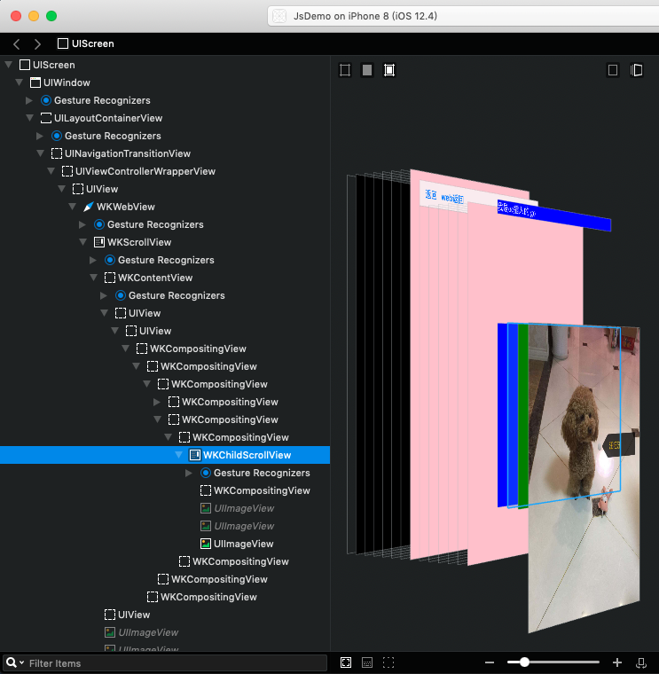

## React Native - 泛 webview 时代

一次学习，随处运行。也就是说，React Native 是存在学习成本。

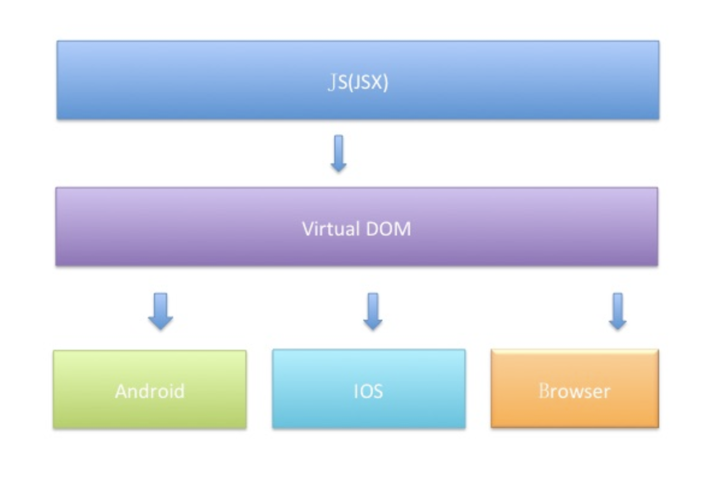

React Native 与 Hybrid 完全没有关系，RN 里 JavaScript 负责处理数据与逻辑，产出结果。它只不过是以 JavaScript 的形式告诉 Objective-C 该执行什么代码，渲染什么UI。

 C 系列的语言，需要经过编译，链接等操作后，产出二进制文件，而 js 是一种脚本语言，它不会经过编译、链接等操作，而是在运行时 才动态的进行词法、语法分析，生成抽象语法树(AST)和字节码，然后由解释器负责执行或者使用 JIT 将字节码转化为机器码再执行。整个流程由 JavaScript 引擎负责完成。(具体见[浅析v8引擎](https://github.com/wayshon/review-2019/blob/master/file/v8%E5%BC%95%E6%93%8E.md))

iOS 提供的 JavaScriptCore 可以创建js上下文执行一段js(上面讲到到过)，在安卓上用的webkit.org开源的jsc.co，两者差不多的玩意，为什么安卓不用 V8，据说是为了 jsc 层api统一。安卓也可以自己换成 V8，但是 iOS 不允许用自己的JS Engine。

### 初始化

使用 RN 脚手架创建的项目在AppDelegate里创建了 RCTBridge，RCTRootView，并把 RCTRootView 挂载的 Controller 作为 window的根视图。自定义集成的项目随意，只需要RCTBridge，RCTRootView，不一定非要作为根Controller。

RN 先创建了一个 Bridge，这是 OC 与 js 沟通的桥梁，创建的时候把AppDelegate作为代理传入，在核心方法setUp中创建BatchedBridge的时候会调用代理的sourceURLForBridge获得 js 文件。


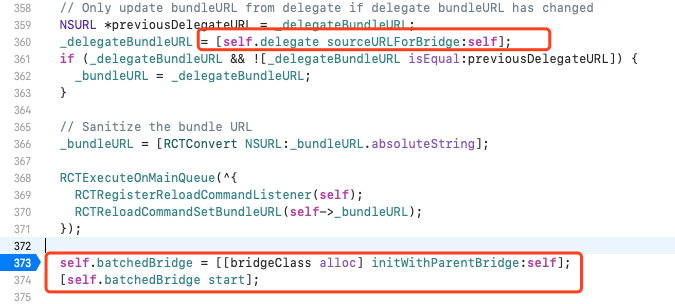

初始化方法的核心是 setUp 方法，而 setUp 方法的主要任务则是创建 BatchedBridge。

BatchedBridge 的作用是批量读取 JavaScript 对 Objective-C 的方法调用，同时它内部持有一个 JavaScriptExecutor，用来执行 JavaScript 代码。

创建 BatchedBridge 的关键是 start 方法，分为以下五个步骤: 

##### 加载 JavaScript 代码
加载打包后的js代码，这里的js已经是jsx转化后的原生js

##### 初始化模块信息
在 initModulesWithDispatchGroup: 中实现，找到所有需要暴露给 js 的类。需要暴露给 js 的类需要执行 RCT_EXPORT_MODULE 宏，暴露给 js 的属性需要执行 RCT_EXPORT_VIEW_PROPERTY，暴露的方法需要执行 RCT_EXPORT_METHOD。我们自己拓展原生模块的时候，也要执行这几个宏。
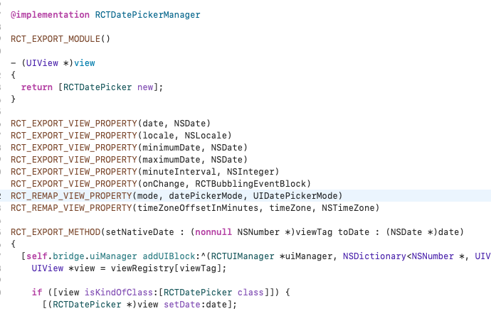

通过RCTModuleClasses 拿到所有暴露给 JavaScript 的类，遍历生成 RCTModuleData。最后的模块表相当于 `Array<RCTModuleData>`

所以，Objective-C 管理模块表的逻辑是：Bridge 持有一个数组，数组中保存了所有的模块的 RCTModuleData 对象。只要给定 ModuleId 和 MethodId 就可以唯一确定要调用的方法
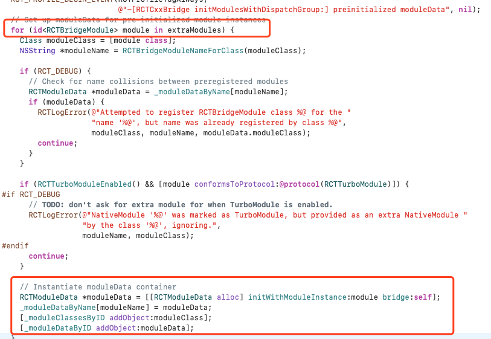

##### 初始化js 执行对象 RCTJSCExecutor
注册一堆 block 到js，js会调用这些回调，注意这里的 block 不是oc主动执行的，而是 js 触发的。比如 nativeRequireModuleConfig，js 在加载模块的时候调用的 loadModule 函数里里会触发 nativeRequireModuleConfig，js 触发调用信息时用到的 nativeFlushQueueImmediate，这里的 MIN_TIME_BETWEEN_FLUSHES_MS 下面再讲
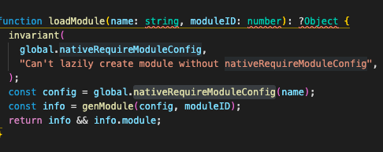
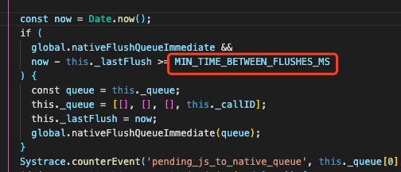

##### 生成模块表并注入 js
在初始化模块信息的时候OC知道了有哪些模块表需要暴露给js，但是 js 还不知道这些模块表。所以这一步就是将模块表注入到js里，赋值给了一个全局变量 `__fbBatchedBridgeConfig`，在 js 里获取这个变量并遍历模块信息

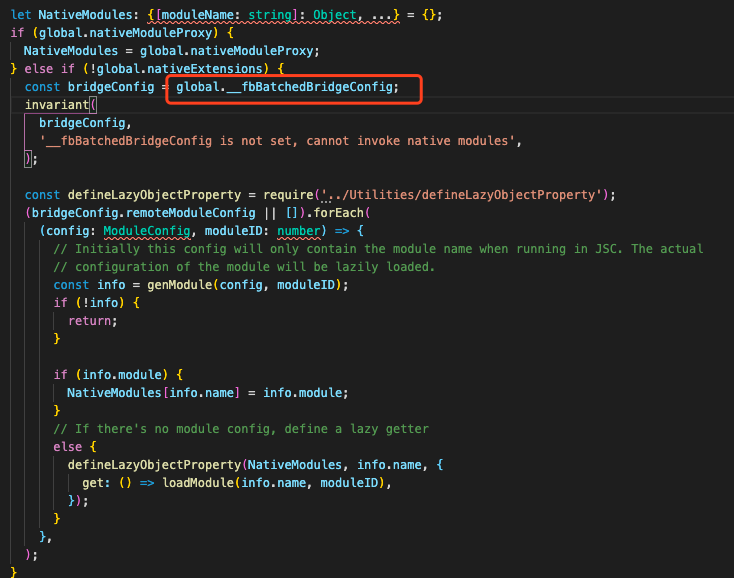

##### 执行 js 代码
这一步就是真正开始执行第一步加载的 js 代码，第三步的 block 也会执行，运行环境准备完成

### 运行时调用
在 RN 中，oc 和 js 的交互都是通过传递 ModuleId、MethodId 和 Arguments 进行的

##### oc 调用 js
前面介绍 JSContext 的讲过，oc 可以直接调用全部的函数，但是在 RN 里并没有直接调用具体的函数，而是通过中转函数 callFunctionReturnFlushedQueue 来传递模块，函数，和参数的。

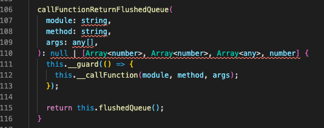

##### js 调用 oc
在之前的 JSContext 介绍，可以将oc对象实现JSExport协议注入到js的上下文给js直接调用。

但是在RN里js一般不会直接调用oc，而是将所触发ModuleId、MethodId 和 Arguments 存放到 MessageQueue 中，等 OC 在 runloop 中取这个队列并执行。

OC 端注册 CADisplayLink 回调，并将 CADisplayLink 添加到 runloop，CADisplayLink 会与屏幕刷新频率相同的速率执行回调，在这个回调里 OC 可以取 MessageQueue 中的任务交给 Yoga 进行布局，然后再调用原生控件渲染UI。Yoga 是一个跨平台库，可以使用flex的方式进行布局


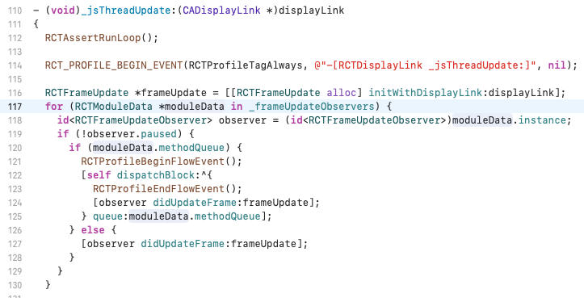

但是有时候由于卡顿等种种原因，OC 不一定能及时的来队列取消息，所以用到了上面步奏3提到的常量`MIN_TIME_BETWEEN_FLUSHES_MS `，查看js代码可以看到，这个值为 5ms，也就是说，超过 5ms js 发现 oc 还没取走消息，就会强制触发 nativeFlushQueueImmediate。

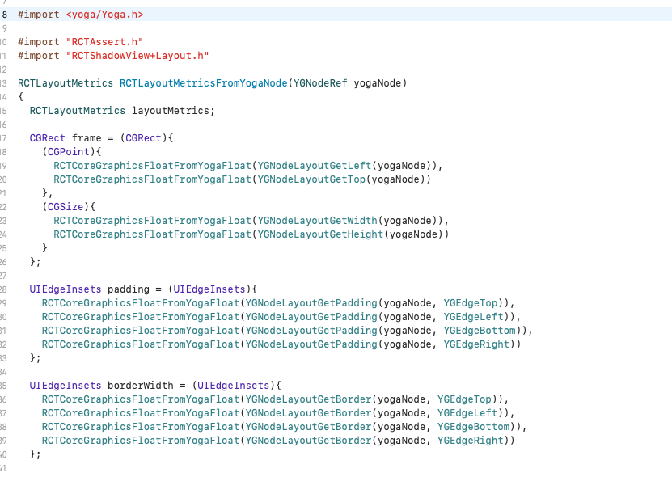
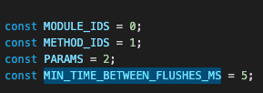

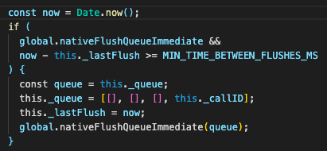

### 优缺点

##### 优点
- 复用了 React 的思想，有利于前端开发者涉足移动端
- 能够动态替换 js boundle 实现增量热更新
- 相比于原生平台，一套代码开发速度更快。相比于 Hybrid 框架，原生控件性能更好

##### 缺点
- RN 有一定的学习成本，Hybrid 对于前端几乎没有学习成本，并且 css 能力强于StyleSheet太多
- 做不到真正的一次编写随处运行，很多组件区分 iOS与安卓平台，开发者依然需要通过 `Platform.OS` 判断平台进行差异化处理，即使是同一个组件，在iOS与安卓的表现形式也不一样
- 由`MIN_TIME_BETWEEN_FLUSHES_MS `可以发现，OC 与 js 通信存在开销，性能比不上纯原生。比如 ListView，rn 先是计算 Virtual Dom，再把计算结果推进 MessageQueue 队列，再等 oc 来取，再通过yoga布局，再在主线程进行渲染。而原生的 UITableView 滚动的时候是在主线程同步渲染列表，并且通过 dequeueReusableCellWithIdentifier 可以高效的复用 cell
- 渲染白屏时间长，不像纯原生渲染的快，boundle.js 里大部分都是基础代码，真正的业务代码占少部分。携程的做法是拆开基础 bundle 与业务 bundle，事先准备好加载好基础bundle的RCTRootView，使用的时候只需要加载业务bundle，这也是因为它是原生集成 RN，而不是整个app都是RN。再加载 native 的时候就可以准备好 RCTRootView，并且业务bundle特别多，基础bundle一份就够了。

## Flutter - 自绘引擎时代
学习中。。。


