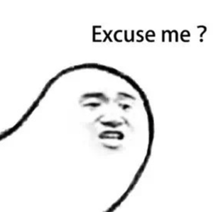

# 位移枚举的使用与位掩码

## 前言

我们在 Objective-C 代码里经常会看到这样的枚举，为什么要这么写？就写个枚举而已还整上位运算了？

```
typedef NS_OPTIONS(NSUInteger, UIControlState) {

  UIControlStateNormal    = 0,

  UIControlStateHighlighted = 1 << 0,         // used when UIControl isHighlighted is set

  UIControlStateDisabled   = 1 << 1,

  UIControlStateSelected   = 1 << 2,         // flag usable by app (see below)

  UIControlStateFocused API_AVAILABLE(ios(9.0)) = 1 << 3, // Applicable only when the screen supports focus

  UIControlStateApplication = 0x00FF0000,       // additional flags available for application use

  UIControlStateReserved   = 0xFF000000        // flags reserved for internal framework use

};
```

## 场景揣测

-   有1个 button

-   有一个事件枚举UIControlEvents，包含多个手势类型

-   有两个事件处理函数 touchUp 和 touchDown

-   给 button 添加事件处理函数，要求：

    -   监听 UIControlEventTouchUpInside 绑定 touchUp 方法
    -   监听 UIControlEventTouchDown 绑定 touchDown 方法

### 首先想到的方法

注册两个事件呗

```
[btn addTarget:self action: @selector(touchUp) forControlEvents:UIControlEventTouchUpInside];

[btn addTarget:self action: @selector(touchDown) forControlEvents:UIControlEventTouchDown];
```

### Apple 官方做法

```
[btn addTarget:self action: @selector(touchUp) forControlEvents:UIControlEventTouchUpInside | UIControlEventTouchDown];
```



**为什么只用一行代码能注册两个事件？forControlEvents 明明只接收一个参数啊？**

**后面的或运算什么鬼？**

点进去看看 UIControlEvents 其实是个枚举

```
typedef NS_OPTIONS(NSUInteger, UIControlEvents) {

  UIControlEventTouchDown                     = 1 << 0,   // on all touch downs

  UIControlEventTouchDownRepeat                  = 1 << 1,   // on multiple touchdowns (tap count > 1)

  UIControlEventTouchDragInside                  = 1 << 2,

  UIControlEventTouchDragOutside                 = 1 << 3,

  UIControlEventTouchDragEnter                  = 1 << 4,

  UIControlEventTouchDragExit                   = 1 << 5,

  UIControlEventTouchUpInside                   = 1 << 6,

  UIControlEventTouchUpOutside                  = 1 << 7,

  UIControlEventTouchCancel                    = 1 << 8,


  UIControlEventValueChanged                   = 1 << 12,   // sliders, etc.

  UIControlEventPrimaryActionTriggered API_AVAILABLE(ios(9.0)) = 1 << 13,   // semantic action: for buttons, etc.


  UIControlEventEditingDidBegin                  = 1 << 16,   // UITextField

  UIControlEventEditingChanged                  = 1 << 17,

  UIControlEventEditingDidEnd                   = 1 << 18,

  UIControlEventEditingDidEndOnExit                = 1 << 19,   // 'return key' ending editing


  UIControlEventAllTouchEvents                  = 0x00000FFF, // for touch events

  UIControlEventAllEditingEvents                 = 0x000F0000, // for UITextField

  UIControlEventApplicationReserved                = 0x0F000000, // range available for application use

  UIControlEventSystemReserved                  = 0xF0000000, // range reserved for internal framework use

  UIControlEventAllEvents                     = 0xFFFFFFFF

};
```

woc，这个枚举不简单，竟然还有位运算。

常规理解，枚举就是一堆常量，是固定的死值，它再是位运算，他也是死值，就算 1 << 2 = 4，这个 4 也是固定的。

回看上面给 button 添加事件的时候用到的 UIControlEvents 枚举，那里的或运算与枚举里的位运算肯定有某种关系

UIControlEventTouchUpInside(1 << 6) | UIControlEventTouchDown(1 << 0) 结果为：

1000000

0000001

***

1000001

所以UIControlEvents最终接收到的值是 1000001

**Q：那么怎么判定 1000001 既等于 1000000 有等于 1 成立呢？**

**A：不用 = 号，而使用与运算 &**

```
- (void)addTarget:(nullable id)target action:(SEL)action forControlEvents:(UIControlEvents)controlEvents {

    if (controlEvents & UIControlEventTouchUpInside) {

        // TouchUp 逻辑

    }

    if (controlEvents & UIControlEventTouchDown) {

        // TouchDown 逻辑

    }

    ...

}
```

由于 1000001 是由 1000000 和 1 进行或运算得到的，所以

1000001 & 1000000 = 1 (true)

1 & 1000000 = 1000000 (true)

即上面两个 if 判断成立，能够注册UIControlEventTouchUpInside和UIControlEventTouchDown事件

**什么？瞎传一个大值不就能与小指与运算成功了？**

1.  瞎传枚举编译过不去，必须是指定枚举值
2.  枚举值内都是向左位移运算的，全是 1 后面跟着数个0，不存在 11111 这种万能值（除非自己定义一个用来匹配所有值的万能值，如 UIControlEventAllEvents）

### 奇怪的知识 - 位掩码

> 什么是”位掩码“。
> 位掩码（BitMask），是”位（Bit）“和”掩码（Mask）“的组合词。”位“指代着二进制数据当中的二进制位，而”掩码“指的是一串用于与目标数据进行按位操作的二进制数字。组合起来，就是”用一串二进制数字（掩码）去操作另一串二进制数字“的意思。


重新设计上面点击事件的栗子，定义一个关于权限的枚举

```
typedef enum {

  roleA = 1 << 0, // 1（十进制 1）

  roleB = 1 << 1, // 10（十进制 2）

  roleC = 1 << 2, // 100（十进制 4）

}AuthType;
```

#### 常规方法

给彦祖分配两个角色 roleA 和 roleC

```
NSMutableArray *auths = [NSMutableArray new];

[auths addObject:@(roleA)];

[auths addObject:@(roleC)];
```

判断彦祖有哪些角色，并做相关操作

```
[auths enumerateObjectsUsingBlock:^(id _Nonnull obj, NSUInteger idx, BOOL * _Nonnull stop) {

    if ([obj isEqual: @(roleA)]) {

      NSLog(@"给彦祖一个面具");

    }

    if ([obj isEqual: @(roleB)]) {

      NSLog(@"给彦祖一把枪");

    }

    if ([obj isEqual: @(roleC)]) {

      NSLog(@"给彦祖一个成龙");

    }

 }];
```

#### 位掩码方法

给彦祖分配两个角色 roleA 和 roleB

通过或运算赋予值

```
NSInteger auth = roleA | roleC;
```

判断彦祖有哪些角色，并做相关操作。

这里彦祖权限为 auth，位掩码为各个枚举值，通过与运算值判断是否为 true

```
if (auth & roleA) {

    NSLog(@"给彦祖一个面具");

}

if (auth & roleB) {

    NSLog(@"给彦祖一把枪");

}

if (auth & roleC) {

    NSLog(@"给彦祖一个成龙");

}
```

对比一下优势明显，一个整型代替数组，同时避免了数组遍历。

**或运算：因为位掩码都是 1 后面跟若干个 0，进行或运算相当于把有 1 的位数都拼凑到一起，有 1 的即拥有对应位的权限。**

**与运算：位掩码的位置有 1 且对应计算的值位置也是 1 结果才是 1，有再多的 1 如果与位掩码对应不上，结果只能是 0，boolean 为 false**

## JavaScript 搞个例子**🌰**

### 要求

-   有3个 button：btn1、btn2、btn3

-   有一个事件枚举: touchDown(鼠标按下)、touchUp(鼠标抬起)、doublieTouch(双击)

-   有3个埋点函数，分别负责：touchDownLog(鼠标按下)、touchUpLog(鼠标抬起)、doublieTouchLog(双击)

-   给 button 添加埋点，要求：

    -   btn1 监听 touchDown 与 touchUp
    -   btn2 监听 touchDown 与 doublieTouch
    -   btn3 监听 touchDown 与 touchUp 与 doublieTouch

### 常规做法

```
const touchDown = 'touchDown';

const touchUp = 'touchUp';

const doublieTouch = 'doublieTouch';


function addEventListener(ele, eventTypes) {

    eventTypes.forEach(eventType => {

        ele.addEventListener(eventType, () => {

            if (eventType === touchDown) {

                ele.addEventListener('mousedown', log(touchDown));

            }

            if (eventType === touchUp) {

                ele.addEventListener('mouseup', log(touchUp));

            }

            if (eventType === doublieTouch) {

                ele.addEventListener('dblclick', log(doublieTouch));

            }

        });

    });

}


addEventListener(btn1, [touchDown, touchUp]);

addEventListener(btn2, [touchDown, doublieTouch]);

addEventListener(btn3, [touchDown, touchUp, doublieTouch]);
```

### 位移枚举做法

```
const touchDown = 1 << 0;

const touchUp = 1 << 1;

const doublieTouch = 1 << 2;


function addEventListener(ele, eventType) {

    if (eventType & touchDown) {

        ele.addEventListener('mousedown', log(touchDown));

    }

    if (eventType & touchUp) {

        ele.addEventListener('mouseup', log(touchUp));

    }

    if (eventType & doublieTouch) {

        ele.addEventListener('dblclick', log(doublieTouch));

    }

}


addEventListener(btn1, touchDown | touchUp);

addEventListener(btn2, touchDown | doublieTouch);

addEventListener(btn2, touchDown | touchUp | doublieTouch);
```

同样的几行判断，少了一层数组和对数组的遍历

