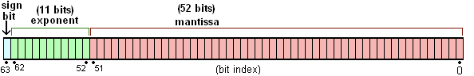
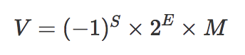

## 浅聊 JavaScript 浮点数

### 背景

在实际开发中，有一个场景 api 返回了毫秒 128639，浏览器侧需要以秒为单位展示，除以1000得到 128.639，最后提交的时候又将秒乘以1000以毫秒为单位提交。然后 128.639 * 1000 = 128639.00000000001，导致类型报错

### 经典问题

为什么 0.1 + 0.1 = 0.2 但是 0.1 + 0.2 = 0.30000000000000004 呢? 

[0.30000000000000004.com](http://0.30000000000000004.com) 展示了各个语言对 0.1 + 0.2 的表现，可以看到很多语言计算的结果都是0.30000000000000004


我们知道计算机只认识0和1（为什么只能是0和1可以单独看看数电），所有的数据需要通过计算机存储、计算或者展示，都需要转换2进制。回顾一下计算机是怎么存储二进制的[补码-计算机存储数据的方式](https://tech.bytedance.net/articles/6972202414157856775)


所以针对上面的问题，我们得先知道怎么将十进制转换为二进制：

- 整数：除2取余，由下往上取结果
- 小数：乘2取整，由上往下取结果

比如：

10 转为二进制为：

1.10 / 2 = 5 余 0

2.5 / 2 = 2 余 1

3.2 / 2 = 1 余 0

4.1 / 2 = 0 余 1

结果：1010

0.1 转二进制为：

1.0.1 * 2 = 0.2 整 0

2.0.2 * 2 = 0.4 整 0

3.0.4 * 2 = 0.8 整 0

4.0.8 * 2 = 1.6 整 1

5.0.6 * 2 = 1.2 整 1

6.0.2 * 2 = 0.4 整 0

**从0.2开始循环**

结果为：0.00011001100110011001100110011001100110011001100110011001...

**由此可见，0.1没办法转换成一个确定的二进制数**

同理0.2转为二进制为：0.00110011001100110011001100110011001100110011001100110011...

0.1 + 0.2 的二进制数为：0.010011001100110011001100110011001100110011001100110011...

**所以0.1 + 0.2在二进制里实际上是无限循环小数**

为了解决部分小数无法使用二进制精确表示的问题，于是就有了IEEE 754规范（浮点数算术标准）。IEEE 754规定了四种表示浮点数值的方式：单精确度（32位）、双精确度（64位）、延伸单精确度（43比特以上，很少使用）与延伸双精确度（79比特以上，通常以80位实现）。

其中最常用的就是32位单精度浮点数(float)和64位双精度浮点数(double)。

**js 使用 64 位固定长度来表示，也就是标准的 double 双精度浮点数**

64位又可分为三个部分：

- 符号位S：第 1 位是正负数符号位（sign），0代表正数(大于等于0)，1代表负数(小于0)
- 指数位E：中间的 11 位存储指数（exponent），表示指数位
- 尾数位M：最后的 52 位是尾数（mantissa），表示有效数字，大于等于1小于2



IEEE标准采用类似于科学计数法的方式表示浮点小数，浮点数值由如下公式表示：



**注意，IEEE 754 对 M 和 E 有一些特殊规定**

M：在计算机内部保存M时，默认这个数的第一位总是1，因此可以被舍去，只保存后面的小数部分。比如保存1.01的时候，只保存01，等到读取的时候，再把第一位的1加上去。这样做的目的，是节省1位有效数字。以64位浮点数为例，留给M只有52位，将第一位的1舍去以后，等于可以保存53位有效数字。

E：E是一个无符号整数（unsigned int）。64位里面11位的E，它的取值范围为0~2047。但是E作为指数来说是可正可负的，所以IEEE 754规定，E的真实值需要加上偏移量才能得到最终值，8位的E是127；11位的E是1023。
> E 为全 0 时：这时，浮点数的指数E等于1-127（或者1-1023），有效数字M不再加上第一位的1，而是还原为0.xxxxxx的小数。这样做是为了表示±0，以及接近于0的很小的数字。
> 
> E 为全 1 时：这时，如果有效数字M全为0，表示±无穷大（正负取决于符号位s）；如果有效数字M不全为0，表示这个数不是一个数（NaN）。

#### 举个例子🌰

将 -0.11 用 IEEE754 格式表示

1. 符号S: 负数，1
2. 指数位E：0.11 = 1.1 * 2^-1 (二进制)，E = 1023 + (-1) = 1022 = 01111111110(二进制)
3. 尾数位M：0.1.....0

所以该浮点数格式为: 1 01111111110 1...000(一共52个0)

**但是，IEEE754并没有解决小数无法精确表示的问题，只是提出了一种使用近似值表示小数的方式，并且引入了精度的概念。**

**对于无限循环的二进制数，在计算机中的表示是近似数，并不是真实值。根据精度不同，近似程度也有所不同。**

**所以用近似值运算就肯定存在精度的问题，得到只能是近似值，不是真实值。**


#### 追问

##### 为什么 js 采用 64 位双精度，却不能表示 int64？

上面说过实际上M最多可用53位，当E为52时，二进制 1.52个x * 2^52 = 1x(52个x)，这也就是为什么说能安全表示(-2^53, 2^53)范围内的数

> (-2^53, 2^53) 为什么是开区间不是闭区间？
> 
> 2^53 不安全在哪？
> 
> Math.pow(2,53) === Math.pow(2,53) + 1  // true
> 
> Number.MAX_SAFE_INTEGER === Math.pow(2,53) - 1 // true

对于整数，[根据ECMA 262-5 标准](https://262.ecma-international.org/5.1/#sec-8.5)，JavaScript能表示并进行精确算术运算的整数范围为：正负2的53次方，也即从最小值-9007199254740992到最大值+9007199254740992之间的范围；对于超过这个范围的整数，JavaScript依旧可以进行运算，但却不保证运算结果的精度。值得注意的是，对于整数的位运算（比如移位等操作），JavaScript仅支持32位整型数，也即从-2147483648到+2147483647之间的整数。

#### 0.1 不是 0.1

为什么 const  a = 0.1，打印 a 得到的是 0.1 而不是 无限小数？

试一下 0.1.toPrecision(20) // 0.10000000000000000555

**实际上我们看到的 0.1 并不是真正的 0.1。**

上面说过实际上M最多可用53位，相当于二进制精度，转成十进制精度为 16 位。者由 Number.EPSILON 可知 js 的最小精度为 2.220446049250313e-16。

例如最大正整数 2^53=9007199254740992，十进制下科学记数法为9.007199254740992e-16

所以 js 最多能表示的十进制精度的长度是小数点后面的 16 位。所以可以使用 toPrecision(16) 来做精度运算，js自动做了这一部分处理，超过的精度会自动做凑整处理

0.10000000000000000555.toPrecision(16) // 0.1000000000000000

#### toFixed Bug

**为什么1.005.toFixed(2) 结果为 1.00 而不是 1.01？**

1.005.toPrecision(17) = 1.0049999999999999 四舍五入时后面的数实际上不足5会被全部舍去

Math.round(1.005 * 100) / 100 = 1 也没用

解决办法往下看 方法一 改良版 multiply

##### Number.isInteger() Bug

**为什么 Number.isInteger(1.0000000000000001) = true ？**

`1.0000000000000001` 转换为二进制为 `1.(53个0)11100`，超过了M的53个二进制位，导致最后的111被丢弃了，最终 `1.(53个0) = 1`

**为什么 Number.isInteger(5e-325) = true ？**

Number.MIN_VALUE = 5e-324，表示了 js 能分辨的最小值，如果小于js能够分辨的最小值，会被自动转为 0。这时，**Number.isInteger** 就会误判

### 解决方案

#### 方法一

##### 普通版

将浮点数转为整数，等计算完之后，再转回浮点数


```
const add1 = (n1, n2) => {

  const n1Precision = (n1.toString().split(".")[1] || '').length;

  const n2Precision = (n2.toString().split(".")[1] || '').length;

  const pow = Math.max(n1Precision, n2Precision);

  const base = Math.pow(10, pow);

  return (n1 * base + n2 * base) / base

}
```

缺点：

- 当遇到科学计数法如 2.3e+1（当数字精度大于21时，数字会强制转为科学计数法形式显示）时这个方法就不管用了
- 小数乘法计算的时候也会有精度问题，比如 0.55 * 100 = 55.00000000000001，其实还是有精度缺失问题

##### 改良版

```
/**

 * 获取浮点数小数部分长度

 * @param {number} n 

 * @returns {number}

 */

const getPrecisionLength = n => {

  const [str, strLen] = n.toString().split(/[eE]/);

  const length = (str.split('.')[1] || '').length - Number(strLen || 0);

  return length > 0 ? length : 0;

}


/**

 * 将参数转成指定精度

 * @param {number} n 

 * @param {number} p 

 * @returns {number}

 */

const getPrecisionNumber = (n, p = 16) => Number(Number(n).toPrecision(p));


/**

 * 小数放大成整数

 * @param {number} n 

 * @returns {number}

 */

const float2Int = n => {

  const len = getPrecisionLength(n);

  const v = len > 0 ? getPrecisionNumber(Number(n) * Math.pow(10, len)) : Number(n);

  if (v > Number.MAX_SAFE_INTEGER || v < Number.MIN_SAFE_INTEGER) {

    throw new Error('越界');

  }

  return v;

}


/**

 * 乘

 * @param {number} n1 

 * @param {number} n2 

 * @returns {number}

 */

const multiply = (n1, n2) => {

  const int1 = float2Int(n1);

  const int2 = float2Int(n2);

  const value = int1 * int2;

  if (value > Number.MAX_SAFE_INTEGER || value < Number.MIN_SAFE_INTEGER) {

    throw new Error('越界');

  }

  return value / Math.pow(10, getPrecisionLength(n1) + getPrecisionLength(n2));

}


/**

 * 加

 * @param {number} n1 

 * @param {number} n2 

 * @returns {number}

 */

const plus = (n1, n2) => {

  const base = Math.pow(10, Math.max(getPrecisionLength(n1), getPrecisionLength(n2)));

  return (multiply(n1, base) + multiply(n2, base)) / base;

}
```

#### 方法二

既然是为了把浮点数转成整数计算，那不如直接把浮点数转成字符串，再去掉小数点，就可以不用乘法计算就得到整数。

```
const add2 = (n1, n2) => {

  const n1Precision = (n1.toString().split(".")[1] || '').length;

  const n2Precision = (n2.toString().split(".")[1] || '').length;

  const pow = Math.max(n1Precision, n2Precision);

  const base = Math.pow(10, pow)


  const intN1 = Number(n1.toString().replace(".", ""));

  const intN2 = Number(n2.toString().replace(".", ""));


  const x = n1Precision < n2Precision ? intN1 * Math.pow(10, (n2Precision - n1Precision)) : intN1;

  const y = n2Precision < n1Precision ? intN2 * Math.pow(10, (n1Precision - n2Precision)) : intN2;


  return (x + y) / base

}
```


**最后：建议使用第三方库 bignumber.js，原理是把所有数字当作字符串，重新实现了计算逻辑，缺点是性能比原生的差很多。**


