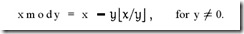

## 补码-计算机存储数据的方式

### 什么是原码
> 第一位为符号位，其余位表示数值的大小

例：十进制数 5，转为二进制为 0101，2 为 0010
5 + 2 的二进制为:

```
   0101
+  0010
-----------
   0111 （7）
```

-5 呢，在计算机怎么表示？

为了在计算机中想办法表示负数，规定在二进制数值前面增加一位符号位（即最高位为符号位）：正数该位为0，负数该位为1。

所以 -5 为 1 0101

符号位 + 值表示方式优点是**简单直观，很容易被人理解**

但是计算机算术逻辑单元（ALU）并没有直接进行减法运算，对于减法，其实也是用加法器来实现的

所以 5 - 2 = 5 + (-2) 原码计算为：

```
   0 0101 （5）
+  1 0010 （-2）
---------------------
   1 0111 （-7）
```

很明显 5 + (-2) 不应该等于 -7

所以，原码在做减法运算的时候就出现了问题。

### 什么是反码
> 反码是基于原码计算得来的，表示方式是：正数的反码是其本身。负数的反码是在其原码的基础上, 符号位不变，其余各个位取反

例如：-2 的原码 1 0010 反码为 1 1101

#### 同余
> 同余概念：
> 
> 有两个整数x、y，如果 x 与 y 除以整数m得到的余数相等，则称x、y对于模m同余
> 
> 记作 x ≡ y (mod m)
> 
> 读作 x 与 y 关于模 m 同余。
> 
> 例：
> 
> 3 mod 12 = 3
> 
> 15 mod 12 = 3
> 
> 27 mod 12 = 3
> 
> 3、15、27 关于模 12 同余

**注意：JavaScript中的运算符 % 是余数运算符，而不是模运算符(主要区别在于如何处理负数)**

例：-2 % 12 = -2 而不是 -10



负数取模运算：x mod y = x 减去 (y 乘上 (x与y的商的下界))

```
function mod(x, y) {
   return x - (y * Math.floor(x / y));
};
```

线性运算定理:（[来自百度百科](https://baike.baidu.com/item/%E5%90%8C%E4%BD%99%E5%AE%9A%E7%90%86/1212360?fromtitle=%E5%90%8C%E4%BD%99&fromid=1432545)）

>如果a ≡ b (mod m)，c ≡ d (mod m) 那么:
>
>(1)a ± c ≡ b ± d (mod m)
>
>(2)a * c ≡ b * d (mod m)

反身性:

> a ≡ a (mod m)

**用时钟举个例子**

当前3点，要想拨到1点有两种方法：
1. 往回拨 2
2. 往前拨 10

所以，-2 ≡ 10 (mod 12)

> 3 ≡ 3 (mod 12)
> 
> -2 ≡ 10 (mod 12)
> 
> 3 - 2 ≡ 3 + 10 (mod 12) // 线性运算定理

我们给负数 -2，找到了它的正数同余数 10，但是并不是 3 - 2 = 3 + 10, 而是 3 - 2 ≡ 3 + 10 (mod 12) 

即两边除以 12 的余数相等，而这个余数只会小于这个模，即余数结果在 12 范围內。


**再一个例子：**

-2 反码为：11111101，转换为十进制 -125，去掉符号为 125

发现有如下规律:
> (-2) mod 127 = 125
> 
> 125 mod 127 = 125
> 
> (-2) ≡ 125 (mod 127)
> 
> 3 - 2 ≡ 3 + 125 (mod 127)
> 
> mod(3 + 125, 127) = 1，128除以127余1

所以说一个数的反码，实际上是这个数对于一个膜的同余数. 而这个膜就是当前盘子能表示的最大值，如上面的 8 位就是127。在时钟里就是 12。得到负数的同余数为正数，然后正向转圈

简单操作：负数的同余数 = 模最大值 + 负数 = 模最大值 - 负数对应的正数。

且：取反计算相当于模的最大值 - 该数，如 0000 0001 取反为 1111 1110 = 1111 1111 - 0000 0001

即： -1 的反码 = -(模最大值 - 1) = 1111 1110

所以：负数的同余数 = 除符号位按位取反

**为什么余数就是最终值？**

在模 12 下计算正负整数，无论怎么算加减法（减法变成了加法，其实只有一种运算），计算结果永远在 0 - 11 之间，是在集合内部的。而上面 3 + 125 = 128 > 127 很明显过了一轮，溢出的部分再参与计算就得到了最终结果，即后面说的送到最低位循环进位

#### 反码码计算的规则

有了反码之后，二进制的运算就可以带着符号位一起了。并且可以直接将减法转换成加法进行运算。但是使用反码进行运算，需要注意以下几点：

- 反码运算时，其符号位与数值一起参加运算。
- 反码的符号位相加后，如果有进位出现，则要把它送回到最低位去相加（循环进位，切记！）。
- 用反码运算，其运算结果亦为反码。在转换为真值时，若符号位为0，数位不变；若符号位为1，应将结果求反才是其真值。

所以 5 - 2 = 5 + (-2) 反码计算为：

```
   0 0101 （5）
+  1 1101 （-2的反码）
------------------------
   0 0011 （反码）
```

0 0011 取反还是 0 0011，转为十进制得到为 3

如上，使用反码，解决了计算机减法运算的问题。

**再看一个例子**

5 - 5 = 5 + (-5) 反码计算为：

```
   0 0101 （5）
+  1 1010 （-5的反码）
-----------------------
   1 1111 （反码）
```

1 1111 取反为 1 0000，十进制结果为 -0

-0 什么鬼，0 0000 与 1 0000 都表示 0，本来 8 位的计算机能表示 256 个数的，由于 0 占用了两个，一共就只能表示 255个数了。表示范围为[-127, +127]

由此可见，**虽然反码解决了减法的问题，但是没法精确表示0**，如0000 0000和 1111 1111都是代表0（正0和负0）

### 什么是补码

> 补码是在原码和反码的基础上衍生出来的，补码的表示方法是：正数的补码就是其本身，负数的补码是在其原码的基础上， 符号位不变， 其余各位取反，最后+1。(即在反码的基础上+1)

#### 补码计算的规则

- 补码运算时，其符号位与数值一起参加运算。
- 补码的符号位相加后，如果有进位出现，则进位被舍弃。
- 用反码运算，其运算结果亦为补码。在转换成原码时，如果是正数，其补码就是原码；如果是负数，该补码的补码就是其原码。

5 - 5 = 5 + (-5) 补码计算为：


```
        0 0101 （5）
+       1 1011 （-5的补码）
---------------------------
1(舍弃)  0 0000 （补码）
```

0 0000 的补码还是 0 0000，十进制结果为 0


有了补码，0的表达方式就唯一了，如果是8位的话，那么就是固定的0000 0000，1000 0000就表示 -128，最终能表示的范围就是[-128, 127]

#### 为什么计算机中会最终选择补码来进行存储和计算数字

1. 计算机的运算器为了实现简单，倾向于在运算过程中将减法转换成加法，统一使用加法运算器进行计算。想要把减法转化成加法运算，就需要在运算时带着符号一起运算，而反码和补码可以带符号位一起运算，也就方便了将减法转换为加法。
2. 采用补码，可以解决编码中有+0和-0两种表示0的方式。
3. 补码表示的数字范围要比原码和反码大。如8位2进制，使用原码或反码表示的范围为[-127, +127], 而使用补码表示的范围为[-128, 127]。

### 上面都是书上说的！

> 那么多资料都在说补码是怎么用的，却很难查到补码怎么来的
> 
> 很多书中就将 取反+1 定义为补码，但也不告诉为什么要这样定义，有点**将手段当成目的**了。

#### 先举个🌰，二进制怎么取相反数

相反数：该数+该数的相反数=0

很明显在二进制中 两个不为0的数相加等于0肯定是由于进位溢出造成的。

比如：

- 1111 1111 + 0000 0001 = 0000 0000
- 即：该数 + 它的相反数=1111 1111 + 0000 0001
- 即：该数相反数 = 1111 1111 - 该数 +0000 0001
- 1111 1111 - 该数 = 该数按位取反
- 所以：该数相反数 = 该数取反 +0000 0001

#### 为什么最终是补码能解决问题

忘记上面讲的一堆反码补码，回到最原始的问题：八位数，分成正负两组，要求：正数 + 负数 = 0，怎么分？

首先可以约定首位 0 为正数，1 为负数

如果按照原码的思路，1 + (-1) = 0000 0001 + 1000 0001 = 1000 0010 = -2 != 0

1 = 0000 0001 正数的表示指定是没啥毛病，肯定是约定 1000 0001 = -1 这种做法欠妥

由上面的取相反数可知，1 + 1的相反数 = 0，1的相反数 = 1取反 + 1

所以，1 + (1取反+1) = 0

所以，1取反+1 可以用来表示 -1，即 -1 = 1取反+1 = 1111 1111

所以：负数的表示方法为：其正数(符号位 1 改成 0)，取相反数（按位取反+1），实际上符号位 0 按位取反又会变成 1

所以：为什么补码的补码是原码？自己的相反数的相反数当然是自己啊

**真相大白，-1 原码 1000 0001 符号位不变，其余部分 取反+1 正好等于，完美对齐课本**

最后补充两个特殊值

- 0000 0000 没有任何值跟它相加等于0，它自己就是 0
- 1000 0000 没有任何值跟它相加等于0，人为约定为 -128
所以8位的补码表示的范围是 [-128, 127]

### 其他

#### 写个四则运算🌰
5(0101) + 4(0100) = 9(1001)

0101 ^ 0100 = 0001

0101 & 0100 = 0100

**两个规律：**

1. 异或运算得到无进位情况下加法结果
2. 与运算后左移一位得到进位结果，即：a + b = a ^ b 无进位结果 + a & b 进位结果
3. 继续对无进位结果与进位结果进行上面的加法运算，直到 a & b 进位结果为 0 为止

```
function calc(a, b) {
  if (b === 0) return a;
  return calc(a ^ b, (a & b) << 1);
}

function convert(a) {
  return calc(~a, 1);
}

function abs(a) {
  return a < 0 ? convert(a) : a;
}

function mul(a, b) {
  const s = (a >= 0 && b >= 0) || (a < 0 && b < 0);
  const absA = abs(a);
  let result = absA;
  let i = abs(b);
  while (i > 1) {
    i = calc(i, -1);
    result = calc(result, absA);
  }
  if (!s) {
    return convert(result);
  }
  return result;
}

function dvd(a, b) {
  const s = (a >= 0 && b >= 0) || (a < 0 && b < 0);
  const absA = abs(a);
  const absB = abs(b);
  let retain = absA;
  let result = 0;
  
  while (retain >= absB) {
    result = calc(result, 1);
    retain = calc(retain, convert(absB));
  }

  if (!s) {
    result = convert(result);
  }
  if (a < 0) {
    retain = convert(retain);
  }

  return { result, retain };
}
```

